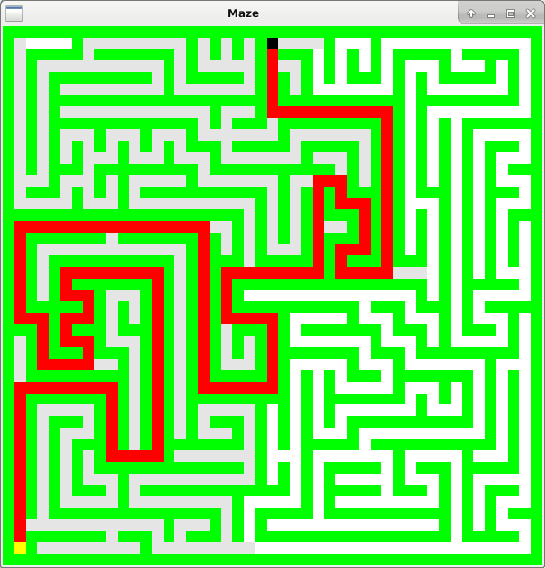

# A\* Algorithm

A\* algorithm that runs in the 2-dimensional space with the squared Euclidean distance.
The program loads a file named __maze.txt__ to a 2-dimensional matriz of characters.
This file encodes a maze with walls, tracks, one indicator to the begin and one to the end.
The A\* algorithm finds the path after the maze loading and the program presents the maze with the path.
The meaning of the cell colors follow:
- Green cells: walls;
- White cells: tracks not discovered by the A\* algorithm;
- Grey cells: tracks discovered;
- Black cell: begin of the maze;
- Yellow cell: end of the maze.

The algorithm uses the __std::vector__ class as a priority queue that stores the already discovered cells.
The elements in this data structure are disposed as a __max-heap__.
The algorithm uses the methods __push_heap__ and __pop_heap__, both implemented in the __algorithm__ library, to maintain the max-heap property.
The heap uses the class member __f__ of the class __Cell__ as key.
As the data structure is a max-heap, the operator __<__ must be overloaded.

## The __maze.txt__ file

There are two available mazes: maze.txt and maze2.txt.
The program opens the file maze.txt, so it is necessary to change the file names for testing the maze2.txt.
If maze2.txt is submitted for loading, the constants __HEI__ and __WID__ must be set to __11__.

The maze must be &#8220;printed&#8221; with characters.
The meaning of the characters follow:
- __\*__ : wall;
- __spacebar__ : track;
- __S__ : begin of the maze (Sink);
- __T__ : end of the maze (Target).

## Sample image

__Maze, path and the found tracks__

## Technical information

- __Platform__: Linux and Windows (not tested)
- __Used libraries__: OpenGL and glut
- __Programming language__: C++
- __Last code change__: 01/22/2020